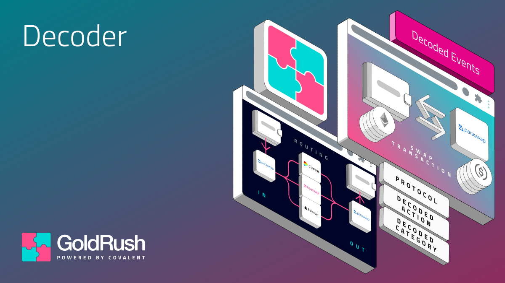

<div align="center">
    
</div>

<p align="center">
  
</p>

<h1 align="center">
Decode unstructured, raw event logs into structured data with a simple API.
</h1>

<div align="center">
Open-source. Public Good. 200+ Chains.
</div>

<br>

This repository contains the logic for decoding a `raw_log_event` of a transaction to meaningful, human-readable, structured data.

## Knowledge Primer

1.  **Config**: A `config` is a mapping of a contract address, network, and protocol name to create a unique configuration for every protocol on all the networks across all the chains for all the contracts. A protocol can have a collection of configs in an array. It looks like

    ```ts
    export type Configs = {
        protocol_name: string;
        network: Chain;
        address: string;
        is_factory: boolean;
    }[];
    ```

2.  **GoldRushDecoder**: The `GoldRushDecoder` class has different methods that enable the decoding logic to run. The various methods are

    1.  `initDecoder`: Scans the `./services/decoder/protocols` directory for all the protocols, extracts the `configs` from them and creates a mapping to the respective decoding function. It is run when the server starts.
    2.  `on`: Creates a decoding function for the specified protocol name on the specified networks. Its declaration is:

        ```ts
        GoldRushDecoder.on(
            "<protocol-name>:<EventName>",
            ["<network_1>", "<network_2>"],
            ABI as Abi,
            async (log, chain_name, covalent_client, tx_metadata): Promise<EventType> => {
                <!-- decoding logic -->
            }
        );
        ```

        The method has 3 arguments:

        1. **Event Id**: A case-sensitive string concatenation of the `protocol name` with the `event name` by a `:`.
        2. **Networks**: An array of all the networks the defined decoding function will run for
        3. **Decoding Function**: The actual decoding function, it has 3 arguments passed to it:
            1. `log`: The raw log event that is being decoded.
            2. `chain_name`: Network to which the log belongs to.
            3. `covalent_client`: The covalent client created with your covalent API key.
            4. `tx_metadata`: The transaction object that generated this log.

    3.  `decode`: The function that chooses which decoding function needs to be called for which log event. It collects all the decoded events for a transaction and returns them in an array of structured data. It is run when the API server receives a request.

### 1. Running the Development Server

Follow the following steps to start the development server of the **GoldRush Decoder**.

1. Install the dependencies

    ```bash
    yarn install
    ```

2. Setup the environmental variables. Refer to [.env.example](.env.example) for the list of environmental variables and store them in `.env` at the root level of the repository.

3. Start the server

    ```bash
    yarn dev
    ```

    The development server will start on the URL - `http://localhost:8080` (port number may change based on the `.env`, 8080 is default).

### 2. API Endpoints

1.  `/api/v1`: The default endpoint for the v1 of the server. A header of the key `x-covalent-api-key` with the value as the [Covalent API key](https://www.covalenthq.com/platform/apikey/) is **mandatory** for the Decoder to work.

    1.  `/tx/decode`: Decodes a transaction of a network.

        Expects the JSON body:

        1.  `network`: The chain name of the transaction
        2.  `tx_hash`: Hash of the transaction to be decoded.

        ```bash
        curl --location 'http://localhost:<PORT>/api/v1/tx/decode' \
        --header 'x-covalent-api-key: <COVALENT_API_KEY>' \
        --header 'Content-Type: application/json' \
        --data '{
        "network": "<CHAIN_NAME>",
        "tx_hash": "<TX_HASH>"
        }'
        ```

### 3. Adding a Decoder

Follow the following steps to add a Decoding logic for an event from a contract of a chain.

1.  Run this on your terminal
    ```bash
    yarn add-config
    ```
2.  Add a Protocol Name for which you want to add an config. If the protocol does not exist, a new protocol will be created. However, if it does exist, another config will be added for that protocol.
3.  Input data as per the prompts. The data required after the `protocol_name` is

    -   `address`: This is the contract address. It can either be a standalone contract or a factory contract.
    -   `is_factory`: If the input address is a factory contract or not.
    -   `network`: The network or chain the added config is for.

    This will modify the configs added to the [Protocols](services/protocols) folder. A config will be added to `${protocol_name}.configs.ts`. A sample decoder with a dummy event name (`<EVENT NAME>`) will be added to `${protocol_name}.decoders.ts`. Along with this, a test file `${protocol_name}.test.ts` will also be created which needs to be fixed so that the test passes.

4.  In `${protocol_name}.decoders.ts`, a decoding logic declaration (`Decoder.on(...) {...}`) will be exposed wherein the decoding logic needs to be implemented. The return type of the decoding function expects:

    ```ts
    export interface EventType {
        category: DECODED_EVENT_CATEGORY;
        action: DECODED_ACTION;
        name: string;
        protocol?: {
            name: string;
            logo: string;
        };
        tokens?: {
            heading: string;
            value: string;
            decimals: number;
            ticker_symbol: string | null;
            ticker_logo: string | null;
            pretty: string;
        }[];
        nfts?: {
            heading: string;
            collection_name: string | null;
            token_identifier: string | null;
            collection_address: string;
            images: {
                default: string | null;
                256: string | null;
                512: string | null;
                1024: string | null;
            };
        }[];
        details?: {
            title: string;
            value: string;
        }[];
    }
    ```

## Contributing

Contributions, issues and feature requests are welcome!
Feel free to check [issues](https://github.com/covalenthq/goldrush-decoder/issues) page.

## Show your support

Give a ⭐️ if this project helped you!

## License

This project is [MIT](LICENSE) licensed.
